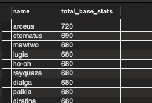
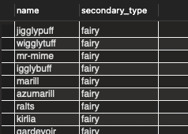
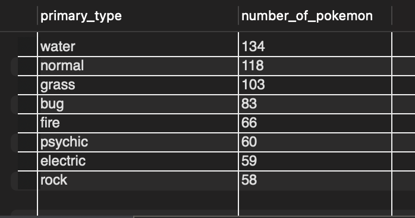
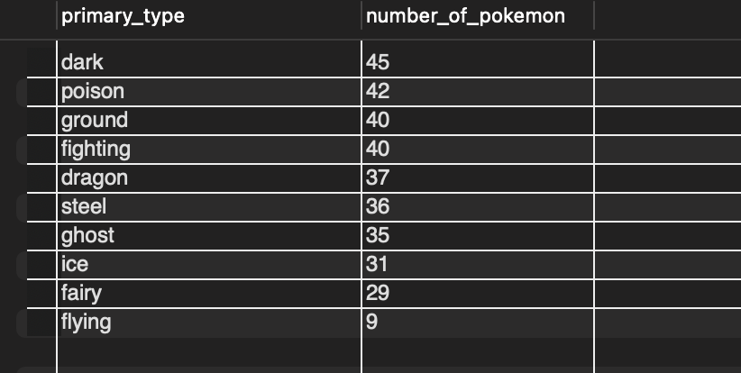
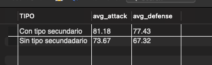
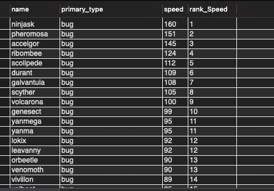

# Proyecto SQL: Análisis de Pokémon

## Exploración y análisis en SQL de una base de datos de Pokémon, enfocada en estadísticas, tipos y generaciones.

Este proyecto presenta un análisis exploratorio en SQL (**MySQL**.) utilizando una base de datos de Pokémon. El dataset contiene información sobre 1025 Pokémon, incluyendo sus tipos, estadísticas base, generación y primera aparición. A través de consultas progresivas se investigan las estadísticas base, diferencias entre tipos primarios y secundarios, tendencias por generación y rankings de atributos como velocidad, ataque y defensa. El objetivo es practicar consultas SQL (incluyendo funciones de agregación, joins, CTEs y funciones de ventana) y al mismo tiempo obtener hallazgos interesantes sobre el mundo Pokémon.

## 📂 Dataset
Puede encontrarse en https://www.kaggle.com/datasets/pauloarayasantiago/pokmon-stats-across-generations-and-typings
Columnas principales:
- `pokemon_id`: Identificador único del Pokémon.
- `name`: Nombre del Pokémon.
- `primary_type`: Tipo primario.
- `secondary_type`: Tipo secundario (puede ser nulo).
- `first_appreance`: Juego en el que apareció por primera vez.
- `generation`: Generación a la que pertenece.
- `category`: Clasificación del Pokémon (regular, legendario, etc.).
- `total_base_stats`: Suma de las estadísticas base (individuales).
- `hp`, `attack`, `defense`, `special_attack`, `special_defense`, `speed`: Estadísticas individuales.

## 🎯 Objetivo
Practicar consultas SQL en distintos niveles de dificultad y generar insights relevantes a partir de los datos.

## 🛠 Tecnologías
- MySQL Workbench
- SQL estándar

## 📊 Consultas realizadas

### Nivel Básico

# --------------------------------------------------------------------------------------------
1. Listar todos los Pokémon con su tipo primario y secundario.

En esta consulta podemos observar que no todos los pokemon cuentan con tipo secundario. Y esto se preserva para todas las generaciones (Gen 1- Gen 8), siendo la primera generación la que tiene más ausencias en el tipo secundario y la generación 6 con menos ausencias.

SELECT name,   primary_type, secondary_type FROM pokeDB; -- Tabla de nombres de pokemon con su tipo primario y secundario

SELECT generation, COUNT(secondary_type) AS number_of_emptys FROM pokeDB -- numero de pokemon sin tipo secundario
WHERE secondary_type = ""
GROUP BY generation
ORDER BY number_of_emptys DESC;

# --------------------------------------------------------------------------------------------
2. Mostrar todos los Pokémon ordenados por `total_base_stats` de mayor a menor.

Muestra una lista de los pokemon ordenada de los más fuertes a más débiles, siendo Arceus el más fuerte y Spewpa el más débil.

# --------------------------------------------------------------------------------------------
3. Filtrar Pokémon por tipo secundario específico.

Esta consulta permite fltrar los pokémon pertenecientes a un sipo secundario específico dado.

# --------------------------------------------------------------------------------------------

4. Contar cuántos Pokémon hay por `primary_type`.

Con esta consulta obtenemos el número de pokémons por tipo primario. Podemos observar que los tipos primarios con mayor población son: agua normal y hierva. Por otro lado los tipos primarios con menor población son: hielo, hada y volador.

Número de pokémon por tipo primario, por encima del promedio. 

SELECT primary_type, sub.number_of_pokemon FROM (
SELECT primary_type, COUNT(primary_type)  AS number_of_pokemon FROM pokeDB
group by primary_type
ORDER BY number_of_pokemon DESC
) AS sub
WHERE sub.number_of_pokemon >= (SELECT round(AVG(number_of_pokemon),2) as  promedio_por_tipo_primario FROM(
	SELECT primary_type, COUNT(primary_type)  AS number_of_pokemon FROM pokeDB
	group by primary_type
) AS prom);

Número de pokémon por tipo primario, por debajo del promedio.

# --------------------------------------------------------------------------------------------

### Nivel Intermedio

# --------------------------------------------------------------------------------------------

1. Promedio de `attack` y `defense` por tipo primario.

En esta consulta, podemos observar el promedio del ataque y defensa, de todos los pokémon correspondientes a cada tipo primario. En este caso se usó GROUP BY.

# --------------------------------------------------------------------------------------------

2. Pokémon más rápido (`speed`) de cada generación.

Esta consulta se realizó de dos maneras distintas: usado JOIN y subconsutas y usando RANK(). Se obtuvo que el pokémon más rápido pertenece a la octava generación, mientras que el pokémon menos veloz, pertenece a la cuarta generación.

SELECT p.generation, p.name,  p.speed from pokeDB as p
JOIN (SELECT generation, MAX(speed) as max_speed FROM  pokeDB
GROUP BY  generation
) AS vm
ON p.generation = vm.generation
AND p.speed = vm.max_speed
ORDER BY p.generation;

# --------------------------------------------------------------------------------------------

3. Top 10 Pokémon con mayor `special_attack`.

Con esta consulta, se obtuvo (dentro del top ten) que el pokémon con mayor special attack es xurkitree y el menor es hoopa. La consulta se elaboró usando DENSE_RANK() y mediante una consulta simple, limitando a 10 resultados.

SELECT name, special_attack FROM(
SELECT name, special_attack, DENSE_RANK() OVER(ORDER BY special_attack DESC) FROM pokeDB
limit 10) AS top_ten;

# --------------------------------------------------------------------------------------------

4. Cantidad de Pokémon sin tipo secundario.
Se realizó un COUNT  de los pokémon con tipo secundario = "". Con est consulta pudimos observar que aproximadamente el 48.69%  de los pokémon, no cuenta con tipo secundario.

# --------------------------------------------------------------------------------------------

## 5. Distribución de Pokémon por generación.

En esta consulta pudimos observar que hubo un descenso en la cantidad de pokémons por generación, de la generación 1 a la 4. En la generación 5 se tuvo un aumento. Para la 6a generación la cantidad de pokemón se redujo a poco más de la mitad, para depues aumentar poco a poco de la generació 7 hasta la última generación en la base de datos (9a gen).

# --------------------------------------------------------------------------------------------

### Nivel Avanzado
1. Tipos primarios cuyo promedio de `total_base_stats` es mayor a 400.

SELECT primary_type, round(AVG(total_base_stats),1) as mean FROM pokeDB
GROUP BY primary_type
HAVING mean > 400;

# --------------------------------------------------------------------------------------------

2. Pokémon más fuerte de cada generación (subconsulta).

Esta subconsulta se realizó utilizando DENSE_RANK().

SELECT name, generation, attack FROM(
SELECT name, generation, attack, DENSE_RANK() OVER (PARTITION BY generation ORDER BY attack DESC) as rank_strong FROM pokeDB) as r
WHERE r.rank_strong = 1;

# --------------------------------------------------------------------------------------------

3. Comparación de promedios de ataque y defensa entre Pokémon con y sin tipo secundario.

Para esta consulta se hizo uso de CASE para hacer una nueva columna, llamada TIPO, en la que se realizara la clasificación de "Con tipo secundario" y "Sin tipo secundario". Se obtuvieron los promedios usando AVG().

Se observa que los pokémon con tipo secundario tienen una pequeña ventaja en promedio de ataque y defensa sobre los pokémon sin tipo secundario.

# --------------------------------------------------------------------------------------------

4. Clasificación de Pokémon por rango de poder usando `CASE`.

Aquí nuevamente se usó CASE para la creación de una nueva columna llamada "poder" en la que se clasifiquen los pokemon de acuerdo con sus estadisticas básicas (total_base_stats: tbs)
Para realizar la partición de manera uniforme, se calculó en rango (Valor mayor- malor menor) y se dividio entre las 4 clasificaciones posibles: Débil, Medio, Fuerte y Legendario. 

Rango = 720-213 = 507
Partición = 507/4 = 126.75 redondeado -->> 127

P1:   tbs< 213+127 = 340 -> Débil
P2:   tbs<= 340+127 = 467 -> Medio
P3:   tbs<= 594 -> Fuerte
P4:   tbs> 594 -> Legendario

SELECT name, total_base_stats,
CASE
	WHEN total_base_stats <= 340 THEN "Débil"
    WHEN total_base_stats <=467 THEN "Medio"
	WHEN total_base_stats <= 594 THEN "Fuerte"
	ELSE "Legendario"
END AS  poder
FROM pokeDB;

# --------------------------------------------------------------------------------------------

5. Ranking de Pokémon por velocidad dentro de cada tipo primario (`DENSE_RANK()`).

En esta última consulta, utilizamos DENSE_RANK() y PARTITION BY para que el ranqueo, se realizara por cada uno de los tipos primarios. Se usó s DENSE_RANK() en vez de RANK(), para que el ranqueo fuera el mismo para los empates.  

# --------------------------------------------------------------------------------------------

## 📌 Conclusiones

1.- Distribución de tipos:

Los tipos Agua, Normal y Planta son los más comunes como tipo primario, mientras que Hada, Hielo y Volador son los menos frecuentes.

Casi la mitad de los Pokémon (48.69%) no tienen un tipo secundario, siendo esto más común en las primeras generaciones.

2.- Evolución por generaciones:

Se observa un crecimiento en el número de Pokémon hasta la generación 2, un descenso hasta la 4, y después una recuperación progresiva hasta la generación 9.

Esto refleja cómo el diseño de nuevas criaturas ha ido variando en cada etapa de la franquicia.

3.- Estadísticas y poder:

El Pokémon con mayor poder total es Arceus, mientras que el más débil es Spewpa.

En cuanto a velocidad, el más rápido pertenece a la generación 8, mientras que el más lento está en la 4.

Los tipos con mejor desempeño en total_base_stats tienen promedios por encima de 400, lo cual indica ventajas competitivas claras.

4.- Clasificación por rangos de poder:

Al clasificar por total_base_stats, se identifican claramente cuatro categorías: Débil, Medio, Fuerte y Legendario, lo cual permite segmentar el universo Pokémon en función de su potencial de combate.

5.- Ataque vs. Defensa según tipo secundario:

Los Pokémon con tipo secundario muestran una ligera ventaja promedio en ataque y defensa, lo cual sugiere que la dualidad de tipos otorga una mayor robustez.

💡 **Nota:** Este proyecto está diseñado para mostrar dominio progresivo en SQL, desde consultas simples hasta técnicas más avanzadas como funciones de ventana y subconsultas.
